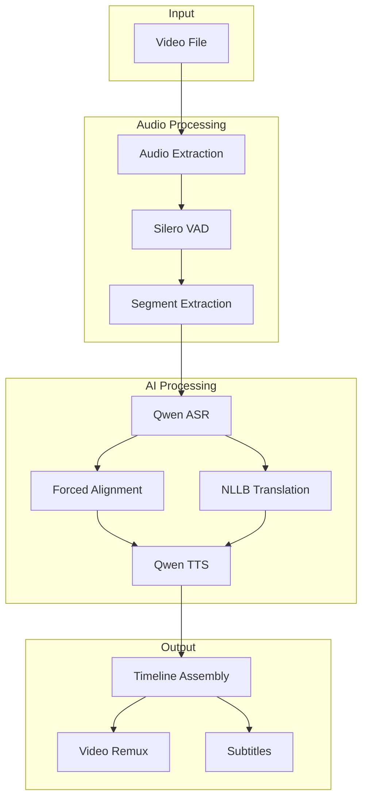
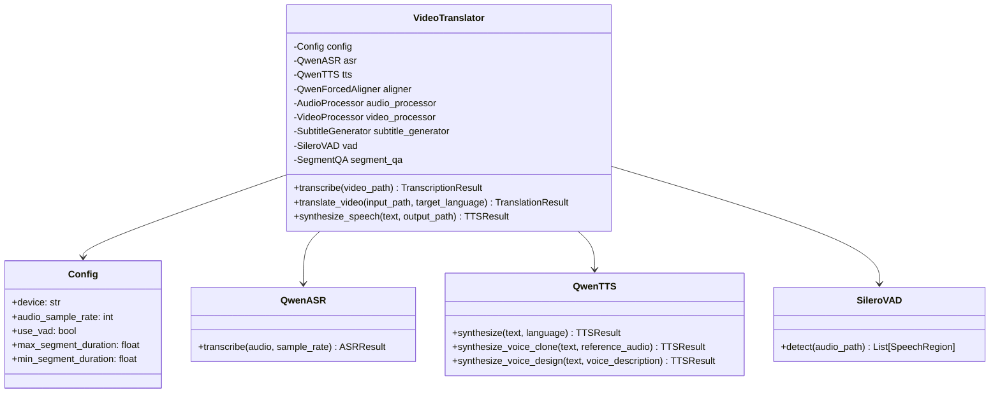
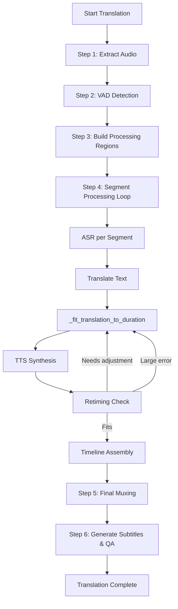
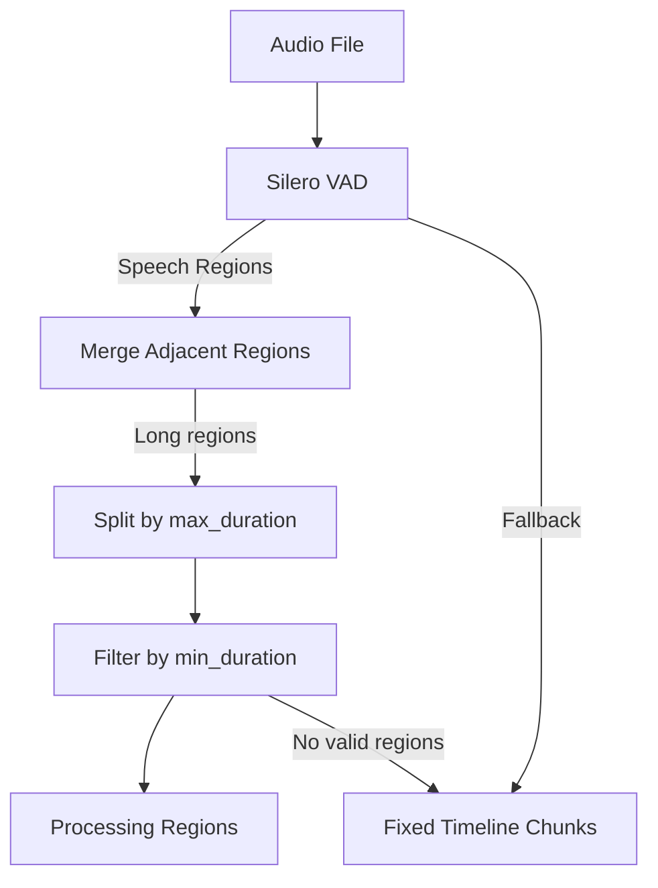
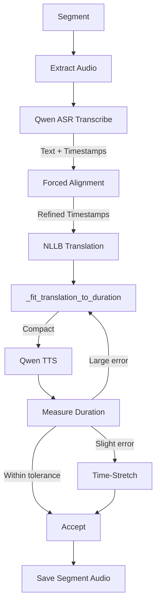
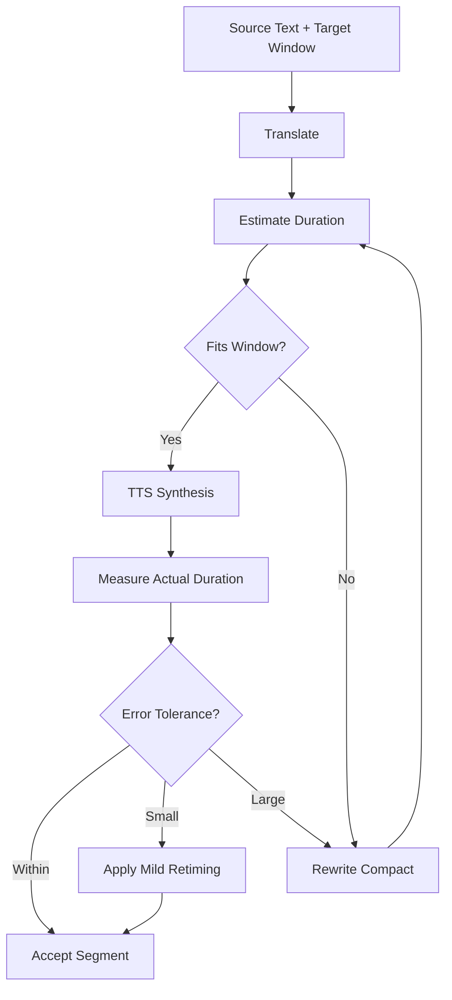
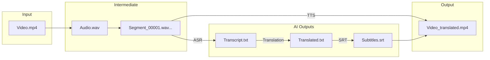

# Video Translator Application - Technical Architecture

## Overview

The Video Translator is an AI-powered pipeline that translates video content from source language to target language while maintaining temporal synchronization. It uses Qwen3 models (ASR, TTS, ForcedAligner) and Silero VAD for voice activity detection.

## High-Level Architecture



## Core Components

### 1. [`VideoTranslator`](src/video_translator/pipeline.py:158) - Main Pipeline Orchestrator

The central class that coordinates all translation steps:



### 2. [`translate_video()`](src/video_translator/pipeline.py:849) - Main Translation Pipeline

The complete translation workflow:



### 3. VAD-Based Segmentation

Voice Activity Detection creates speech regions for processing:



### 4. Segment Processing Flow

Each speech segment goes through this pipeline:



### 5. Duration Control Loop

Critical for maintaining synchronization:



### 6. Data Flow Diagram



## Key Models

### [`QwenASR`](src/video_translator/models/asr.py:34) - Speech Recognition

- Uses `Qwen/Qwen3-ASR-1.7B` model
- Supports 52 languages
- Provides word-level timestamps
- Optional forced aligner integration

### [`QwenTTS`](src/video_translator/models/tts.py:31) - Text-to-Speech

- Uses `Qwen/Qwen3-TTS-12Hz-1.7B-CustomVoice`
- Three modes:
  - **Basic**: Preset voices
  - **Voice Clone**: From reference audio
  - **Voice Design**: From natural language description

### [`SileroVAD`](src/video_translator/processing/vad.py:29) - Voice Activity Detection

- Uses Silero VAD model
- Falls back to energy-based detection if unavailable
- Configurable thresholds for speech detection

### [`SegmentQA`](src/video_translator/processing/qa.py:23) - Quality Assurance

Validates segment timing and audio quality:
- Duration mismatch detection
- Gap/overlap detection
- Clipping detection

## Configuration

The [`Config`](src/video_translator/config.py:11) class manages settings via Pydantic:

```python
Config(
    device="auto",              # cuda/mps/cpu
    audio_sample_rate=16000,    # Hz
    use_vad=True,               # Enable VAD
    max_segment_duration=30.0,  # seconds
    min_segment_duration=1.0,   # seconds
    vad_threshold=0.5,          # VAD confidence threshold
)
```

## CLI Usage

```bash
# Transcribe video
video-translator transcribe input.mp4

# Translate video
video-translator translate input.mp4 --target-language spanish

# TTS from text
video-translator tts input.txt --language Spanish
```

## File Structure

```
src/video_translator/
├── pipeline.py          # Main VideoTranslator class
├── config.py            # Configuration management
├── cli.py               # CLI entry point
├── models/
│   ├── asr.py          # QwenASR wrapper
│   ├── tts.py          # QwenTTS wrapper
│   └── aligner.py      # QwenForcedAligner wrapper
└── processing/
    ├── vad.py          # SileroVAD implementation
    ├── audio.py        # FFmpeg audio processing
    ├── video.py        # FFmpeg video processing
    ├── subtitles.py    # SRT/VTT generation
    └── qa.py           # Quality assurance checks
```

## Technical Highlights

1. **Modular Architecture**: Each component is independently testable
2. **VAD Fallback**: Energy-based VAD if Silero unavailable
3. **Translation Caching**: NLLB model loaded once per pipeline
4. **Device Auto-Detection**: Automatically selects cuda/mps/cpu
5. **Segment Parallelization**: Audio extraction uses ThreadPoolExecutor
6. **Duration Control**: Iterative retry loop for timing fit
7. **QA Integration**: Automatic validation of all segments

This architecture enables processing of long-form videos (2-3 hours) by breaking them into manageable segments while maintaining temporal synchronization with the original video.