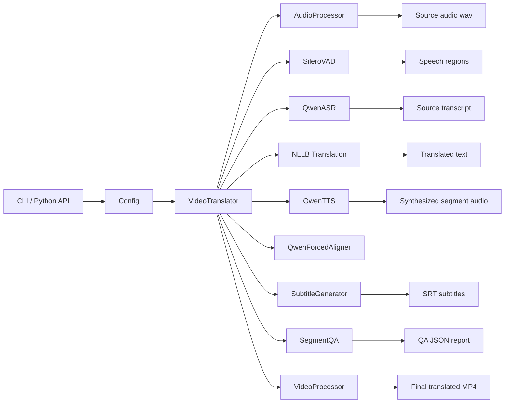
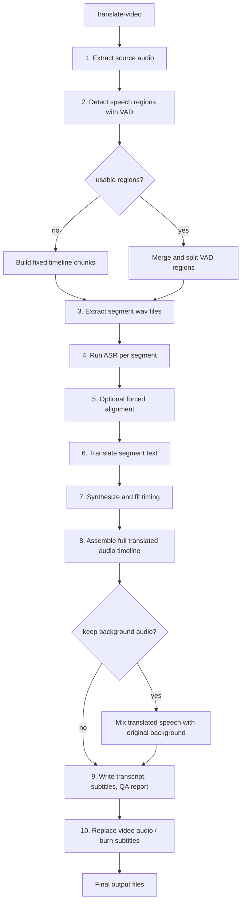
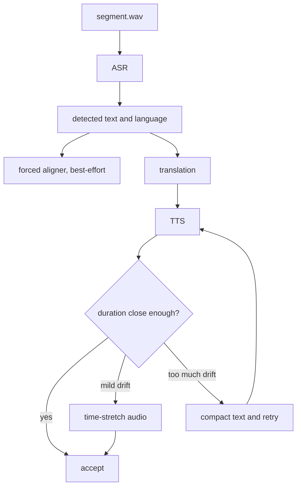

# Video Translator Architecture

## Purpose

This repository is a CLI-first video dubbing pipeline. It takes an input video, extracts speech, translates the spoken content, synthesizes new speech in the target language, and remuxes the result back into a final video.

The main runtime entrypoint is [`translate-video`](../src/video_translator/cli.py), which delegates to [`VideoTranslator.translate_video()`](../src/video_translator/pipeline.py).

## System Diagram

## Main Runtime Flow

## Component Responsibilities

### CLI

- File: [`src/video_translator/cli.py`](../src/video_translator/cli.py)
- Provides commands for transcription, TTS, alignment, and full translation.
- Builds config from environment or a user-supplied `--config` env file.

### Config

- File: [`src/video_translator/config.py`](../src/video_translator/config.py)
- Uses `pydantic-settings`.
- Supports environment variables and `.env` files.
- Holds model, hardware, segmentation, subtitle, and output settings.

### Pipeline Orchestrator

- File: [`src/video_translator/pipeline.py`](../src/video_translator/pipeline.py)
- Lazily loads models and processing helpers.
- Coordinates extraction, segmentation, ASR, translation, TTS, subtitle generation, QA, and muxing.

### Audio and Video Processing

- Files:
  - [`src/video_translator/processing/audio.py`](../src/video_translator/processing/audio.py)
  - [`src/video_translator/processing/video.py`](../src/video_translator/processing/video.py)
- FFmpeg-backed utilities for extraction, segment slicing, time-stretching, timeline assembly, background mixing, and final remux.

### ASR / TTS / Alignment

- Files:
  - [`src/video_translator/models/asr.py`](../src/video_translator/models/asr.py)
  - [`src/video_translator/models/tts.py`](../src/video_translator/models/tts.py)
  - [`src/video_translator/models/aligner.py`](../src/video_translator/models/aligner.py)
- `QwenASR` produces transcript text and optional timestamps.
- `QwenTTS` supports preset voice, voice cloning, and voice design.
- `QwenForcedAligner` is best-effort in the current pipeline and does not yet drive downstream cue timing.

### Segmentation

- File: [`src/video_translator/processing/vad.py`](../src/video_translator/processing/vad.py)
- Primary mode uses Silero VAD.
- Fallback mode uses simple energy-based speech detection.
- If detected regions are unusable, the pipeline falls back again to fixed timeline chunks.

## Segment Processing Flow

Each extracted speech region follows this path:

## Outputs

The full translation pipeline emits:

- translated `.wav` audio track
- translated `.mp4` video
- translated text transcript
- `.srt` subtitles when enabled
- segment JSON report with timing and QA issues

## Current Strengths

- Clean orchestration in one pipeline class
- Good fallback behavior around segmentation
- Model loading is lazy, which keeps startup simpler
- NLLB translation backend is cached and reused within a run
- Timing fit loop is pragmatic and easy to reason about

## Current Limitations

- Forced alignment is called but not used to refine subtitles or retiming decisions
- ASR, translation, and TTS are still processed serially per segment
- Translation fallback previously became silent original-text passthrough
- Subtitle shaping helpers existed but were not applied in the main translation flow
- README/config mention API-oriented pieces that are not implemented in this repo

## Improvements Implemented In This Iteration

- `--config` now actually loads a user-provided env file in the CLI
- subtitle shaping is now applied for single-language subtitle modes:
  - merge nearby cues
  - split oversized cues
- segment reports now include translation metadata:
  - source language
  - translation status
  - translation error when the pipeline fell back to the original text

## Recommended Next Improvements

1. Make forced alignment feed real downstream timing.
2. Add resumable per-segment caching for ASR, translation, and TTS.
3. Introduce bounded concurrency for model stages.
4. Promote QA from report-only to automatic retry rules.
5. Add explicit translation failure policy: warn, retry, or hard-fail.
6. Either implement the API/worker stack or remove those claims from docs and config.
