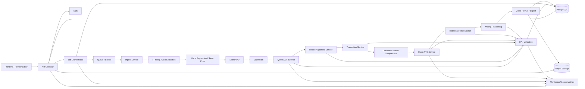
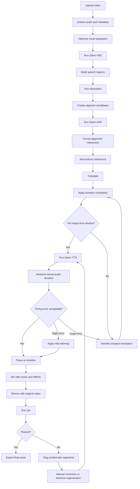
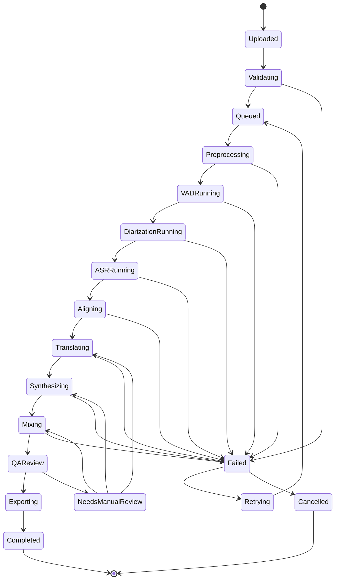
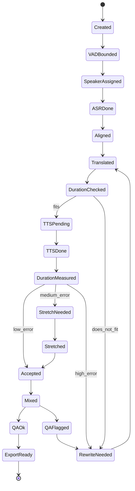
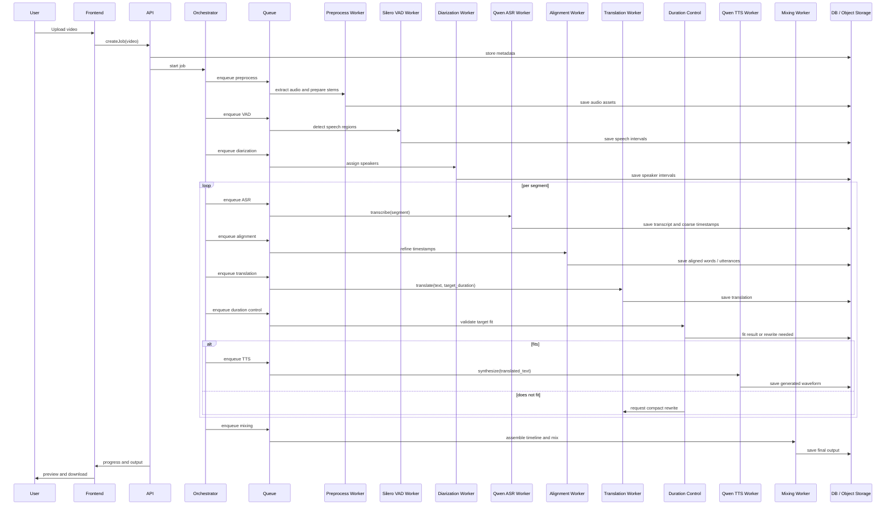
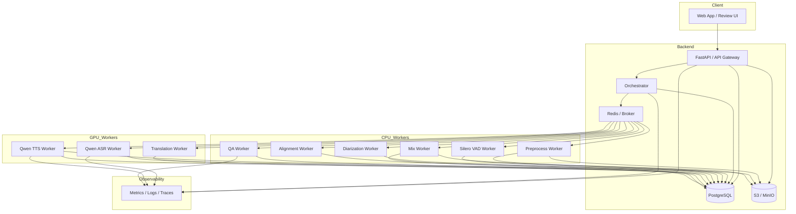
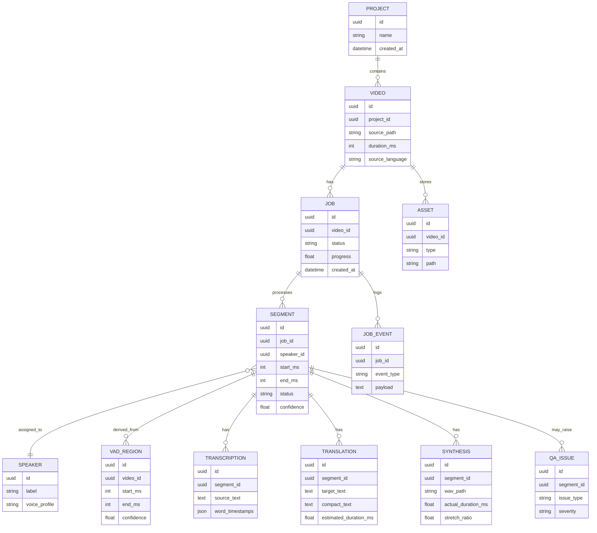
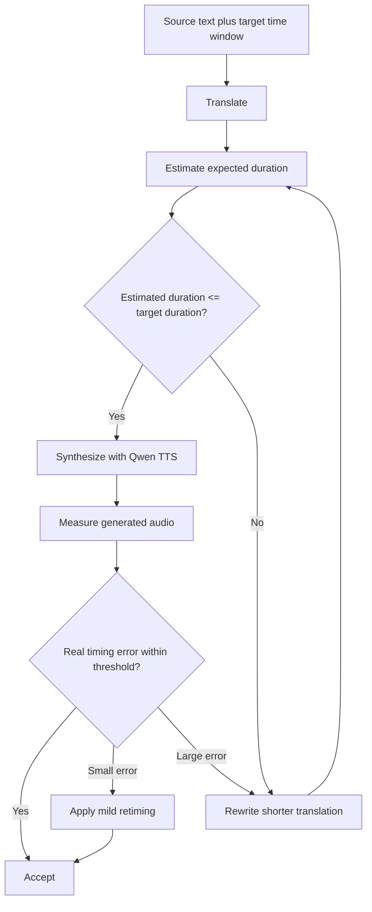
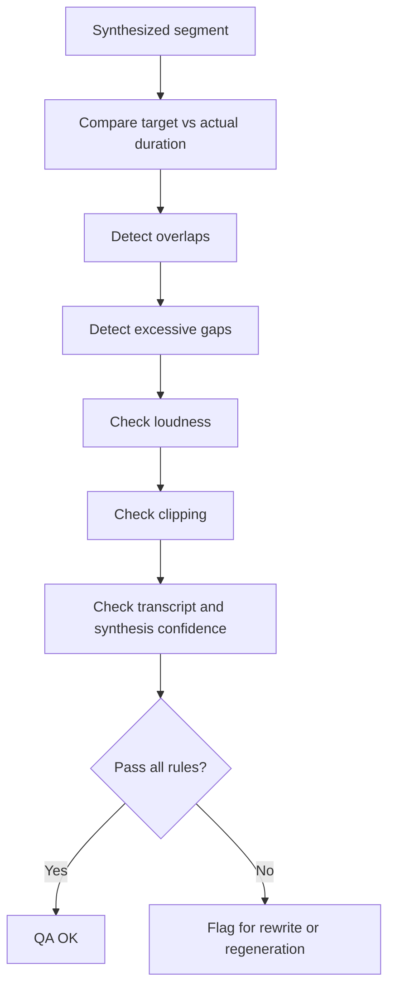

# Long-Form Video Audio Translation and Dubbing System
## Final Technical Overview for a Developer Reader

## 1. Project goal

Build an application that takes a long video, such as a 2–3 hour interview, podcast, lecture, documentary, or film-like asset, and produces a translated audio track that stays synchronized with the original video timeline.

The core requirement is not only translation accuracy. The system must also preserve temporal alignment with the image, which means:

- each spoken intervention should start and end in the correct time window,
- pauses should feel natural,
- the generated translated voice should fit the original scene timing,
- the final dubbed track should be mixable back into the original video.

This is a long-form batch processing system, not a simple real-time subtitle translator.

---

## 2. Design principle

For long videos, the correct architecture is modular.

Do not process the entire video as one monolithic audio job.  
Instead, process the video as a sequence of time-bounded speech segments.

The main pipeline is:

1. ingest video,
2. extract and preprocess audio,
3. detect where speech exists with an open-source VAD,
4. split and align speaker utterances,
5. run ASR,
6. refine timestamps,
7. translate with duration constraints,
8. synthesize speech,
9. retime when necessary,
10. mix and export.

The VAD is important. In this design, use an **open-source, current VAD**, specifically **Silero VAD**, as the speech activity detector.

---

## 3. Why VAD is necessary

ASR and alignment are not enough by themselves.

Qwen ASR can transcribe and produce timestamps.  
A forced aligner can refine those timestamps.  
Qwen TTS can synthesize translated speech.

But none of those components is the right tool for deciding where speech actually starts and stops in a noisy long-form track.

A dedicated VAD provides:

- cleaner initial segmentation,
- better preservation of silence and pacing,
- lower ASR cost by skipping non-speech regions,
- fewer bad boundaries,
- better system stability over thousands of segments.

For this reason, VAD should be part of the production architecture from the start.

---

## 4. Recommended stack

### Core models and services

- **Silero VAD** for voice activity detection
- **Speaker diarization** for speaker segmentation
- **Qwen ASR** for transcription and coarse timestamps
- **Forced alignment** for timestamp refinement
- **Translation service** with duration-aware rewriting
- **Qwen TTS** for target-language speech synthesis
- **Time-stretch / retiming** for final fit correction
- **Mixing and remuxing** for final delivery

### Infrastructure

- **FastAPI** or similar backend API
- **Job orchestrator**
- **Queue / broker** such as Redis-backed workers
- **PostgreSQL** for metadata and state
- **Object storage** for intermediate and final assets
- **FFmpeg** for extraction, remux, audio handling

---

## 5. High-level component diagram

---

## 6. End-to-end pipeline flow

---

## 7. Job state diagram

---

## 8. Segment state diagram

In production, the real unit of work is the segment, not the whole video.

---

## 9. Sequence diagram

---

## 10. Deployment diagram

---

## 11. Data model

---

## 12. Critical subflow: duration control

This is the most important logic loop in the whole system.

The largest technical risk is not ASR quality.  
It is temporal mismatch between translated text and available speaking time.

---

## 13. Critical subflow: QA

---

## 14. Processing strategy for 2–3 hour videos

The system should not be designed around “one video job.”

It should be designed around a large collection of independently managed segments.

Typical rules:

- initial preprocessing over the full file,
- VAD creates speech regions,
- speech regions are grouped into manageable chunks,
- each chunk produces aligned utterances,
- each utterance becomes the unit for translation and TTS,
- failed utterances are retried without restarting the full job.

This makes the system:

- restartable,
- parallelizable,
- auditable,
- much cheaper to debug,
- compatible with manual intervention.

---

## 15. What the VAD changes in the architecture

With no VAD, the pipeline depends on fixed-size windows or rough chunking.  
That causes poorer speech boundary quality and more downstream repair.

With VAD, the system gains a better first approximation of speech timing before ASR.  
That improves:

- segmentation quality,
- pacing reconstruction,
- non-speech filtering,
- cost efficiency,
- synchronization reliability.

In other words, VAD reduces downstream correction pressure.

---

## 16. Recommended MVP

A practical first production-grade MVP should include:

- video upload,
- audio extraction,
- optional stem preparation,
- Silero VAD,
- speaker diarization,
- Qwen ASR,
- forced alignment,
- translation with target-duration constraints,
- Qwen TTS,
- light retiming,
- timeline assembly,
- QA checks,
- manual review interface for failed segments.

The manual review interface is not a luxury.  
It is part of a realistic production system.

---

## 17. Final engineering judgment

For long-form translated dubbing, the architecture should not rely on Qwen ASR and Qwen TTS alone.

It should use:

- **Silero VAD** for speech activity detection,
- **Qwen ASR** for transcription,
- **forced alignment** for timestamp precision,
- **duration-aware translation** for timing control,
- **Qwen TTS** for synthesis,
- **retiming and QA** for final synchronization quality.

That architecture is technically coherent, scalable to multi-hour videos, and much more likely to produce stable synchronization against picture.

---

## 18. Suggested next implementation step

The next sensible step is to convert this document into:

- a repository blueprint,
- service contracts and payload schemas,
- database migrations,
- queue task definitions,
- and a first worker implementation order.

A good implementation sequence would be:

1. ingest plus preprocessing,
2. VAD plus segmentation,
3. ASR plus alignment,
4. translation plus duration-control loop,
5. TTS plus retiming,
6. mixing plus export,
7. review UI plus QA tooling.
