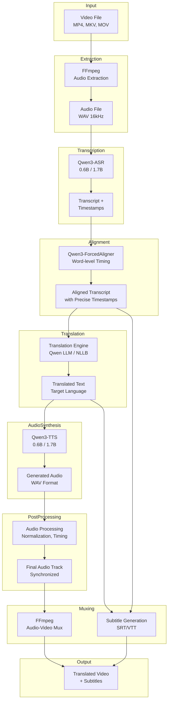
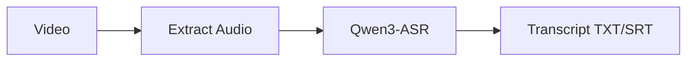
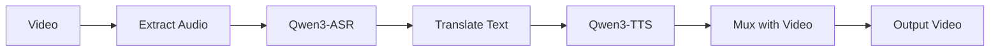
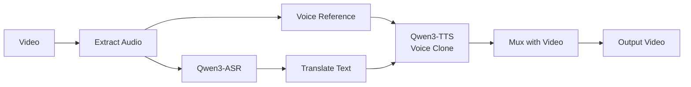
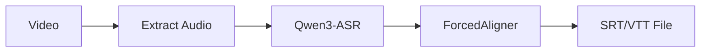
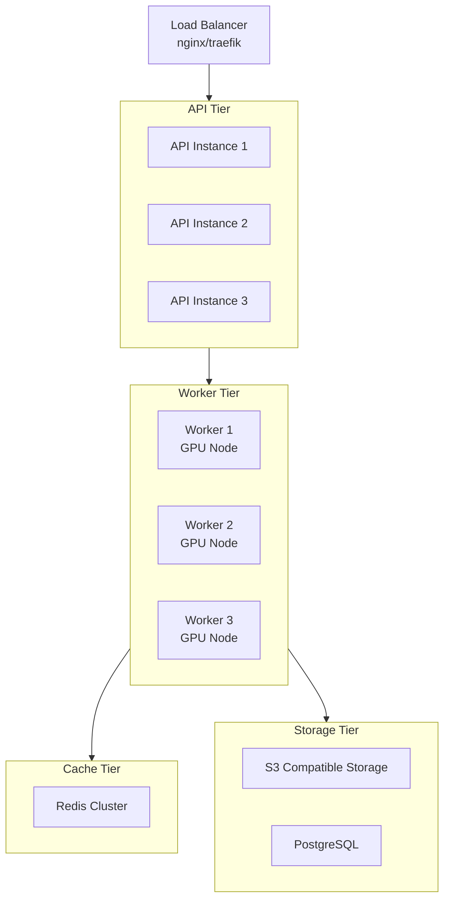

# 🎬 Video Translator Application Architecture

## 📋 Executive Summary

This document presents a comprehensive architecture for an open-source video translation pipeline using **Qwen3** family models. The system handles the complete workflow from audio extraction to final video production with translated audio and subtitles.

---

## 🔗 Reference URLs & Documentation

### Core Models & Repositories

| Component | Repository | Documentation | License |
|-----------|------------|---------------|---------|
| **Qwen3-TTS** (Main) | [`QwenLM/Qwen3-TTS`](https://github.com/QwenLM/Qwen3-TTS) | [Qwen Blog](https://qwen.ai/blog?id=qwen3-tts-vc-voicedesign) | Apache 2.0 |
| **Qwen3-ASR** | [`QwenLM/Qwen3-ASR`](https://github.com/QwenLM/Qwen3-ASR) | [Qwen Blog](https://qwen.ai/blog?id=qwen3asr) | Apache 2.0 |
| **Qwen3-ForcedAligner** | [`Qwen/Qwen3-ForcedAligner-0.6B`](https://huggingface.co/Qwen/Qwen3-ForcedAligner-0.6B) | [Technical Report](https://arxiv.org/pdf/2601.18220) | Apache 2.0 |
| **Qwen3-ASR-Toolkit** | [`QwenLM/Qwen3-ASR-Toolkit`](https://github.com/QwenLM/Qwen3-ASR-Toolkit) | [Toolkit Docs](https://github.com/QwenLM/Qwen3-ASR-Toolkit) | MIT |

### Community Integrations

| Tool | Repository | Description |
|------|------------|-------------|
| **ComfyUI-Qwen-TTS** | [`flybirdxx/ComfyUI-Qwen-TTS`](https://github.com/flybirdxx/ComfyUI-Qwen-TTS) | ComfyUI nodes for TTS with multilingual support |
| **ComfyUI-Qwen3-ASR** | [`kaushiknishchay/ComfyUI-Qwen3-ASR`](https://github.com/kaushiknishchay/ComfyUI-Qwen3-ASR) | ComfyUI nodes for ASR and ForcedAligner |
| **Qwen3-TTS-Pinokio** | [`SUP3RMASS1VE/Qwen3-TTS-Pinokio`](https://github.com/SUP3RMASS1VE/Qwen3-TTS-Pinokio) | Apple Silicon support (M1/M2/M3) |
| **qwen-tts2api** | [`aahl/qwen-tts2api`](https://github.com/aahl/qwen-tts2api) | OpenAI Speech API compatible wrapper |
| **Q3-TTS (Apple)** | [`esendjer/Q3-TTS`](https://github.com/esendjer/Q3-TTS) | macOS Apple Silicon optimized |

### Installation Guides & Tutorials

| Resource | URL | Type |
|----------|-----|------|
| Complete 2026 Guide | [Medium Article](https://medium.com/@zh.milo/qwen3-tts-the-complete-2026-guide-to-open-source-voice-cloning-and-ai-speech-generation-1a2efca05cd6) | Tutorial |
| ComfyUI Installation | [JURN Guide](https://jurn.link/dazposer/index.php/2026/01/24/qwen3-tts-install-and-test-in-comfyui/) | Step-by-step |
| ForcedAligner Guide | [Sonu Sahani Blog](https://sonusahani.com/blogs/qwen3-forcedaligner) | Tutorial |
| Dev.to Guide | [Dev.to Article](https://dev.to/gary_yan_86eb77d35e0070f5/qwen3-tts-complete-guide-to-open-source-text-to-speech-model-9oe) | Quick Start |

### FFmpeg Resources

| Resource | URL | Description |
|----------|-----|-------------|
| Super User Guide | [Replace Audio](https://superuser.com/questions/1137612/ffmpeg-replace-audio-in-video) | Audio replacement commands |
| Mux.com Tutorial | [Merge Audio/Video](https://www.mux.com/articles/merge-audio-and-video-files-with-ffmpeg) | Professional workflow |
| Stack Overflow | [Mapping Issues](https://stackoverflow.com/questions/12938581/ffmpeg-mux-video-and-audio-from-another-video-mapping-issue) | Stream mapping |

---

## 🏗️ System Architecture

### High-Level Pipeline



### Component Architecture

```mermaid
flowchart LR
    subgraph API_Layer["API Layer"]
        REST[REST API<br/>FastAPI]
        WS[WebSocket<br/>Streaming]
        CLI[CLI Interface]
        GUI[Web UI<br/>Gradio]
    end
    
    subgraph Core["Core Services"]
        PM[Pipeline Manager]
        QM[Queue Manager<br/>Redis/RabbitMQ]
        CM[Config Manager]
    end
    
    subgraph Models["Model Services"]
        ASR[Qwen3-ASR Service]
        FA[ForcedAligner Service]
        TTS[Qwen3-TTS Service]
        TR[Translation Service]
    end
    
    subgraph Storage["Storage Layer"]
        FS[File System<br/>Temp/Output]
        DB[(SQLite/PostgreSQL<br/>Job Metadata)]
        CACHE[Model Cache]
    end
    
    API_Layer --> Core
    Core --> Models
    Models --> Storage
```



---

## 📦 Model Specifications

### Qwen3-ASR Family

| Model | Parameters | VRAM Required | Download Size | Languages | Use Case |
|-------|------------|---------------|---------------|-----------|----------|
| **Qwen3-ASR-0.6B** | 600M | 4-6 GB | ~2.5 GB | 52 | CPU/Limited GPU |
| **Qwen3-ASR-1.7B** | 1.7B | 6-8 GB | ~4.5 GB | 52 | High Accuracy |

**Key Features:**
- Automatic Language Detection (52 languages + 22 dialects)
- Streaming support with ~92ms time-to-first-token
- Noise robust (works with background music/singing)
- Long audio support (up to 20 minutes per pass)

### Qwen3-ForcedAligner

| Model | Parameters | VRAM Required | Download Size | Languages | Max Duration |
|-------|------------|---------------|---------------|-----------|--------------|
| **Qwen3-ForcedAligner-0.6B** | 600M | ~2 GB | ~979 MB | 11 | 5 minutes |

**Supported Languages:** Chinese, English, French, German, Italian, Japanese, Korean, Portuguese, Russian, Spanish

**Performance:** Average Absolute Alignment Score (AAS): 42.9ms (outperforms MFA, WhisperX, NFA)

### Qwen3-TTS Family

| Model | Parameters | VRAM Required | Download Size | Languages | Latency |
|-------|------------|---------------|---------------|-----------|---------|
| **Qwen3-TTS-0.6B-Base** | 600M | 4-6 GB | ~1.7 GB | 10 | ~120ms |
| **Qwen3-TTS-1.7B-Base** | 1.7B | 6-8 GB | ~4.5 GB | 10 | ~97ms |
| **Qwen3-TTS-12Hz-CustomVoice** | 1.7B | 8-16 GB | ~6 GB | 10 | ~97ms |
| **Qwen3-TTS-12Hz-VoiceDesign** | 1.7B | 8-16 GB | ~6 GB | 10 | ~97ms |

**Supported Languages:** Chinese, English, Japanese, Korean, French, German, Spanish, Portuguese, Russian, Italian

**Key Features:**
- Voice Design: Create voices from natural language descriptions
- Voice Clone: Clone from 3-15 second reference audio
- Custom Voice: 49+ preset voices with instruction-based control
- Streaming: Real-time synthesis with 97ms end-to-end latency

---

## 🎯 Application Modes

### Mode 1: Simple Transcription


### Mode 2: Full Translation


### Mode 3: Voice Clone Translation


### Mode 4: Subtitle Generation Only


---

## 💻 Technical Stack

### Backend

| Component | Technology | Purpose |
|-----------|------------|---------|
| **Framework** | FastAPI | REST API, WebSocket |
| **Queue** | Celery + Redis | Async job processing |
| **Database** | SQLite (dev) / PostgreSQL (prod) | Job metadata, config |
| **Model Serving** | Transformers + PyTorch | Local inference |
| **Audio Processing** | FFmpeg, Librosa | Extraction, normalization |

### Frontend

| Component | Technology | Purpose |
|-----------|------------|---------|
| **Web UI** | Gradio / React | User interface |
| **CLI** | Typer/Click | Command-line interface |
| **API Client** | Python/Node.js SDK | Programmatic access |

### Infrastructure

| Component | Technology | Purpose |
|-----------|------------|---------|
| **Container** | Docker + Docker Compose | Deployment |
| **Model Storage** | HuggingFace Hub | Model downloads |
| **File Storage** | Local FS / S3 | Temporary files |

---

## 📁 Project Structure

```
video_translator/
├── README.md
├── LICENSE
├── requirements.txt
├── pyproject.toml
├── docker-compose.yml
├── Dockerfile
│
├── src/
│   ├── __init__.py
│   ├── main.py                 # Application entry point
│   ├── config.py               # Configuration management
│   │
│   ├── api/
│   │   ├── __init__.py
│   │   ├── routes/
│   │   │   ├── __init__.py
│   │   │   ├── transcription.py
│   │   │   ├── translation.py
│   │   │   ├── tts.py
│   │   │   └── video.py
│   │   └── middleware/
│   │       ├── __init__.py
│   │       └── auth.py
│   │
│   ├── core/
│   │   ├── __init__.py
│   │   ├── pipeline.py         # Main pipeline orchestrator
│   │   ├── queue.py            # Job queue management
│   │   └── utils.py            # Utility functions
│   │
│   ├── models/
│   │   ├── __init__.py
│   │   ├── asr.py              # Qwen3-ASR wrapper
│   │   ├── forced_aligner.py   # Qwen3-ForcedAligner wrapper
│   │   ├── tts.py              # Qwen3-TTS wrapper
│   │   └── translation.py      # Translation service
│   │
│   ├── processing/
│   │   ├── __init__.py
│   │   ├── audio.py            # Audio extraction/processing
│   │   ├── video.py            # Video muxing
│   │   └── subtitles.py        # SRT/VTT generation
│   │
│   └── ui/
│       ├── __init__.py
│       ├── gradio_app.py       # Gradio web interface
│       └── cli.py              # CLI commands
│
├── tests/
│   ├── __init__.py
│   ├── test_asr.py
│   ├── test_tts.py
│   ├── test_pipeline.py
│   └── test_api.py
│
├── models_cache/               # Downloaded models (gitignored)
│   ├── qwen-asr/
│   ├── qwen-forced-aligner/
│   └── qwen-tts/
│
├── output/                     # Generated files (gitignored)
│   ├── audio/
│   ├── video/
│   └── subtitles/
│
└── docs/
    ├── architecture.md
    ├── installation.md
    ├── api_reference.md
    └── usage_guide.md
```

---

## 🔧 Configuration

### Environment Variables

```bash
# Model Configuration
QWEN_ASR_MODEL=Qwen/Qwen3-ASR-1.7B
QWEN_ALIGNER_MODEL=Qwen/Qwen3-ForcedAligner-0.6B
QWEN_TTS_MODEL=Qwen/Qwen3-TTS-12Hz-1.7B-CustomVoice

# Hardware Configuration
DEVICE=cuda              # cuda, mps, cpu
PRECISION=bf16           # bf16, fp16, fp32
FLASH_ATTENTION=true     # Enable FlashAttention 2

# API Configuration
API_HOST=0.0.0.0
API_PORT=8000
API_KEY=your-secret-key

# Storage Configuration
MODEL_CACHE_DIR=./models_cache
OUTPUT_DIR=./output
TEMP_DIR=/tmp/video_translator

# Queue Configuration
REDIS_URL=redis://localhost:6379
CELERY_WORKERS=2

# Translation Configuration
TRANSLATION_ENGINE=qwen      # qwen, nllb, deepseek
TARGET_LANGUAGE=es           # Target language code
```

### Model Download Script

```bash
#!/bin/bash
# download_models.sh

# ASR Models
huggingface-cli download Qwen/Qwen3-ASR-1.7B --local-dir ./models_cache/qwen-asr-1.7b
huggingface-cli download Qwen/Qwen3-ASR-0.6B --local-dir ./models_cache/qwen-asr-0.6b

# Forced Aligner
huggingface-cli download Qwen/Qwen3-ForcedAligner-0.6B --local-dir ./models_cache/qwen-forced-aligner

# TTS Models
huggingface-cli download Qwen/Qwen3-TTS-12Hz-1.7B-CustomVoice --local-dir ./models_cache/qwen-tts-custom
huggingface-cli download Qwen/Qwen3-TTS-12Hz-1.7B-VoiceDesign --local-dir ./models_cache/qwen-tts-design
huggingface-cli download Qwen/Qwen3-TTS-25Hz-0.6B-Base --local-dir ./models_cache/qwen-tts-base
```

---

## 🚀 API Endpoints

### Transcription

```yaml
POST /api/v1/transcribe:
  summary: Transcribe audio from video
  requestBody:
    content:
      multipart/form-data:
        schema:
          type: object
          properties:
            video:
              type: string
              format: binary
            model:
              type: string
              enum: [0.6B, 1.7B]
              default: 1.7B
            with_timestamps:
              type: boolean
              default: true
            language:
              type: string
              description: Auto-detected if not specified
  responses:
    200:
      content:
        application/json:
          schema:
            type: object
            properties:
              job_id: string
              status: string
              result:
                type: object
                properties:
                  text: string
                  language: string
                  timestamps: array
                  srt_url: string
```

### Translation

```yaml
POST /api/v1/translate:
  summary: Translate transcript
  requestBody:
    content:
      application/json:
        schema:
          type: object
          properties:
            text: string
            target_language: string
            preserve_timing: boolean
  responses:
    200:
      content:
        application/json:
          schema:
            type: object
            properties:
              translated_text: string
              aligned_segments: array
```

### Text-to-Speech

```yaml
POST /api/v1/tts:
  summary: Generate speech from text
  requestBody:
    content:
      application/json:
        schema:
          type: object
          properties:
            text: string
            language: string
            voice:
              type: object
              properties:
                mode: string
                  enum: [preset, clone, design]
                speaker: string
                reference_audio: string
                description: string
            speed: float
            emotion: string
  responses:
    200:
      content:
        audio/wav:
          schema:
            type: string
            format: binary
```

### Video Translation

```yaml
POST /api/v1/translate-video:
  summary: Full video translation pipeline
  requestBody:
    content:
      multipart/form-data:
        schema:
          type: object
          properties:
            video:
              type: string
              format: binary
            target_language: string
            voice_clone: boolean
            reference_audio: string
            generate_subtitles: boolean
  responses:
    200:
      content:
        application/json:
          schema:
            type: object
            properties:
              job_id: string
              status: string
              result:
                type: object
                properties:
                  video_url: string
                  subtitles_url: string
                  transcript_url: string
```

---

## 📊 Performance Benchmarks

### Expected Processing Times (per minute of video)

| Component | 0.6B Model | 1.7B Model | Hardware |
|-----------|------------|------------|----------|
| **ASR Transcription** | 15-30s | 10-20s | RTX 3090 |
| **Forced Alignment** | 5-10s | 5-10s | RTX 3090 |
| **TTS Generation** | 20-40s | 15-30s | RTX 3090 |
| **Full Pipeline** | 40-80s | 30-60s | RTX 3090 |

### VRAM Requirements

| Configuration | Minimum VRAM | Recommended VRAM |
|---------------|--------------|------------------|
| **ASR 0.6B + TTS 0.6B** | 8 GB | 12 GB |
| **ASR 1.7B + TTS 1.7B** | 12 GB | 16 GB |
| **Full Pipeline (all models)** | 16 GB | 24 GB |

---

## 🔒 Security Considerations

1. **API Authentication**: JWT tokens for API access
2. **File Upload Limits**: Maximum file size restrictions
3. **Sandboxed Execution**: Container isolation for model inference
4. **Rate Limiting**: Prevent abuse of compute resources
5. **Data Retention**: Automatic cleanup of temporary files

---

## 📈 Scalability Options

### Horizontal Scaling



### Model Optimization Strategies

1. **Model Quantization**: 4-bit/8-bit quantization for reduced VRAM
2. **Batch Processing**: Process multiple segments together
3. **Model Caching**: Keep frequently used models in VRAM
4. **Dynamic Loading**: Load/unload models based on demand
5. **FlashAttention**: 2-3x speedup with FlashAttention 2

---

## 🎯 Implementation Phases

### Phase 1: Core Pipeline (Week 1-2)
- [ ] Basic audio extraction with FFmpeg
- [ ] Qwen3-ASR integration
- [ ] Qwen3-TTS integration
- [ ] Simple CLI interface
- [ ] Basic FFmpeg muxing

### Phase 2: API & Web UI (Week 3-4)
- [ ] FastAPI REST endpoints
- [ ] Gradio web interface
- [ ] Job queue with Celery
- [ ] Progress tracking
- [ ] File management

### Phase 3: Advanced Features (Week 5-6)
- [ ] Voice cloning support
- [ ] Voice design mode
- [ ] Forced alignment integration
- [ ] SRT/VTT subtitle generation
- [ ] Batch processing

### Phase 4: Optimization & Production (Week 7-8)
- [ ] Docker containerization
- [ ] Performance optimization
- [ ] Error handling & logging
- [ ] Documentation
- [ ] Testing suite

---

## 🧪 Testing Strategy

### Unit Tests
- Model wrapper functions
- Audio processing utilities
- API endpoint validation

### Integration Tests
- End-to-end pipeline execution
- FFmpeg command validation
- File I/O operations

### Performance Tests
- VRAM usage monitoring
- Processing time benchmarks
- Concurrent job handling

---

## 📝 Appendix: FFmpeg Commands Reference

### Extract Audio
```bash
ffmpeg -i input.mp4 -vn -acodec pcm_s16le -ar 16000 -ac 1 output.wav
```

### Replace Audio Track
```bash
ffmpeg -i video.mp4 -i audio.wav -c:v copy -c:a aac -map 0:v:0 -map 1:a:0 -shortest output.mp4
```

### Keep All Streams Except Original Audio
```bash
ffmpeg -y -i video.mp4 -i audio.wav -c copy -map 0 -map -0:a -map 1:a output.mp4
```

### Generate SRT from Timestamps
```python
# Python function to convert timestamps to SRT format
def generate_srt(segments):
    srt_content = ""
    for i, seg in enumerate(segments, 1):
        start = format_timestamp(seg['start'])
        end = format_timestamp(seg['end'])
        text = seg['text']
        srt_content += f"{i}\n{start} --> {end}\n{text}\n\n"
    return srt_content
```

---

## 📚 Additional Resources

### HuggingFace Model Pages
- [Qwen3-ASR-1.7B](https://huggingface.co/Qwen/Qwen3-ASR-1.7B)
- [Qwen3-ASR-0.6B](https://huggingface.co/Qwen/Qwen3-ASR-0.6B)
- [Qwen3-ForcedAligner-0.6B](https://huggingface.co/Qwen/Qwen3-ForcedAligner-0.6B)
- [Qwen3-TTS-12Hz-1.7B-CustomVoice](https://huggingface.co/Qwen/Qwen3-TTS-12Hz-1.7B-CustomVoice)
- [Qwen3-TTS-12Hz-1.7B-VoiceDesign](https://huggingface.co/Qwen/Qwen3-TTS-12Hz-1.7B-VoiceDesign)

### Community Resources
- [Reddit r/LocalLLaMA - Qwen3-TTS Release](https://www.reddit.com/r/LocalLLaMA/comments/1qlzbhh/release_qwen3tts_ultralow_latency_97ms_voice/)
- [Reddit r/comfyui - Qwen3 TTS Nodes](https://www.reddit.com/r/comfyui/comments/1qn2wfm/qwen3_tts_voice_design_and_multicharacter_dialogue/)
- [Hacker News Discussion](https://news.ycombinator.com/item?id=Qwen3-TTS)

### Video Tutorials
- [How to Install Qwen3-TTS in ComfyUI](https://www.youtube.com/watch?v=Z8LR2FCZKrg)
- [Qwen3 TTS Voice Design Tutorial](https://www.youtube.com/watch?v=AR6JcdzbeW0)
